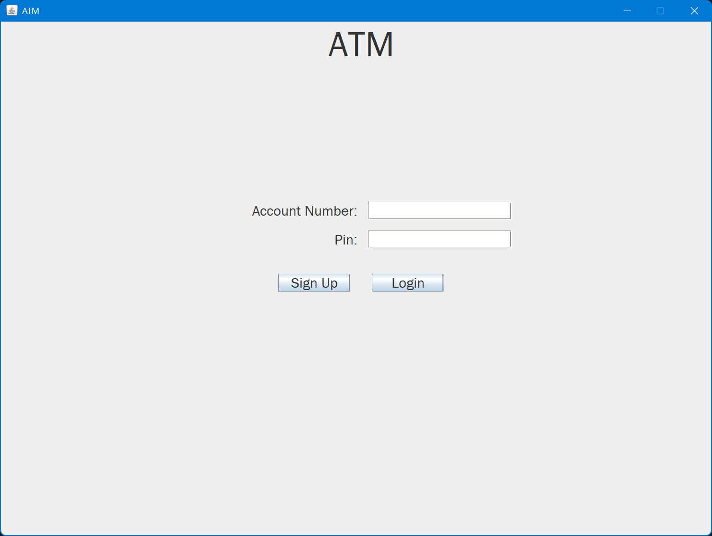
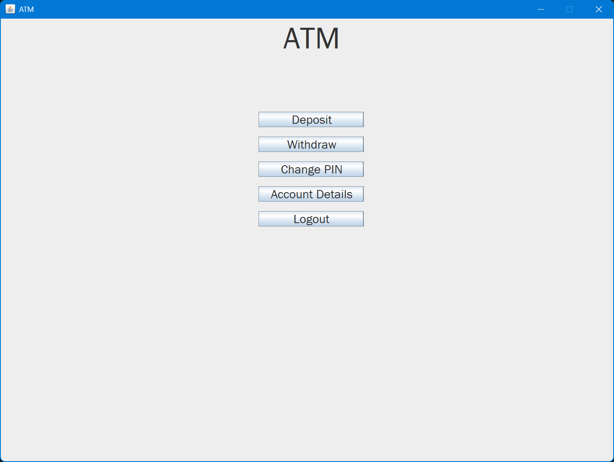
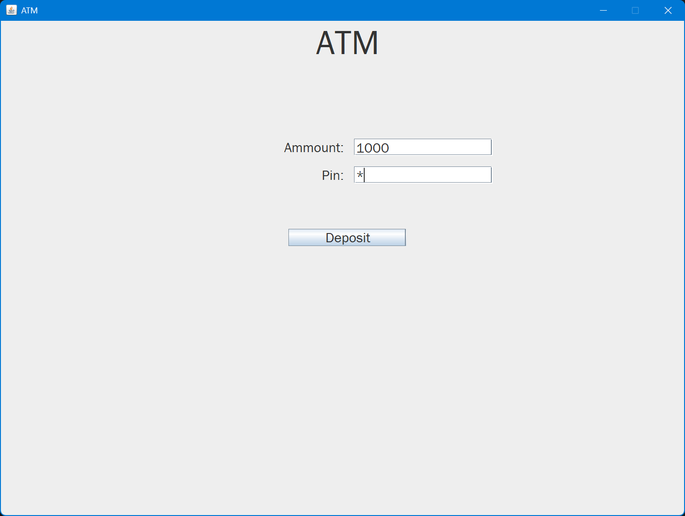
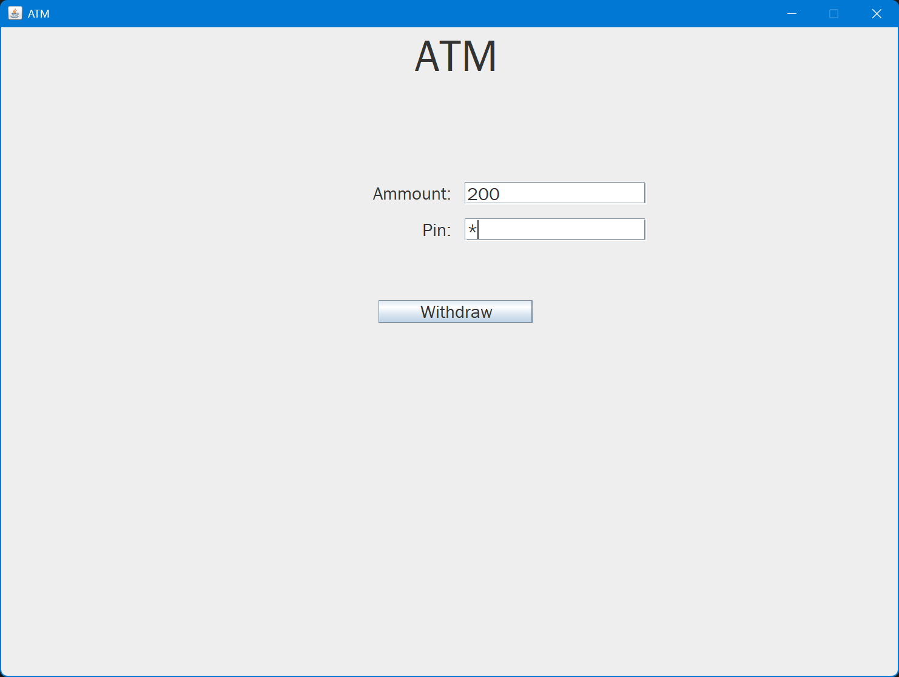
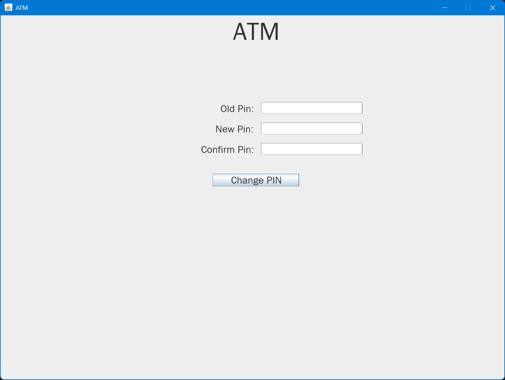
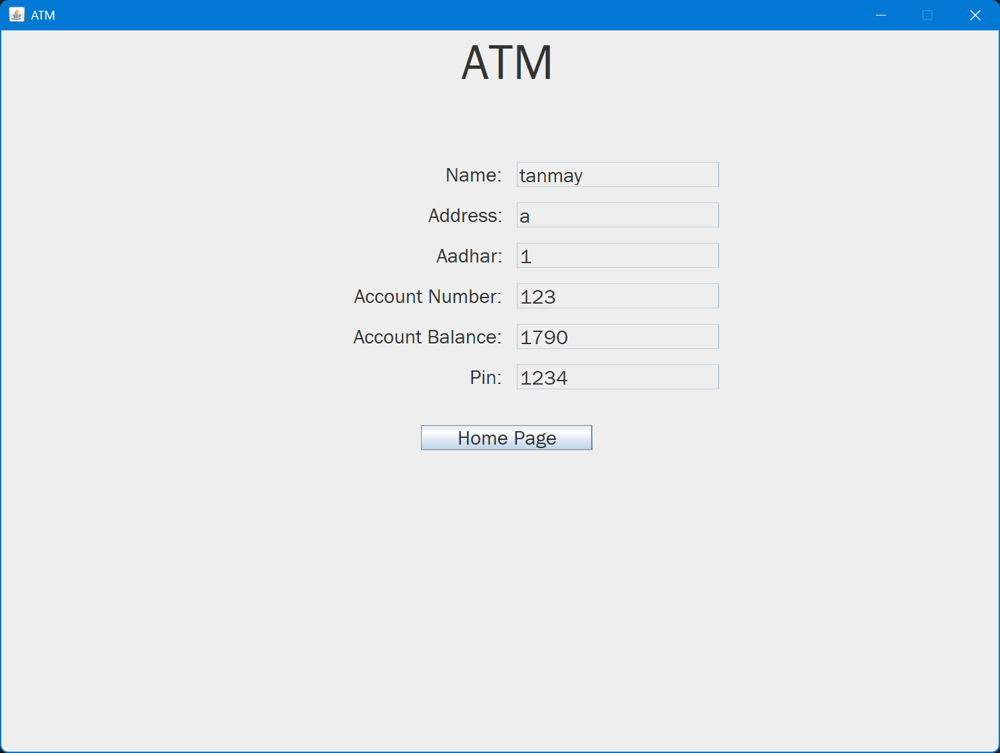

# ATM Simulator Project

This ATM Simulator project is a Java-based application that simulates the functionalities of an Automated Teller Machine (ATM). It is designed using Java Swing for the graphical user interface and connects to a MySQL database to manage user accounts and transactions.

## Table of Contents

- [Features](#features)
- [Requirements](#requirements)
- [Setup](#setup)
- [Usage](#usage)
- [Screenshots](#screenshots)
- [Contributing](#contributing)
- [License](#license)

## Features

The ATM Simulator project provides the following features:

1. **User Authentication:**
   - User login using a unique account number and PIN.
   - User signup to create a new account.

2. **Account Management:**
   - View account balance and details.
   - Change PIN for account security.

3. **Transaction Handling:**
   - Deposit funds into the account.
   - Withdraw funds from the account.

## Requirements

To run the ATM Simulator project, you need the following:

- Java Development Kit (JDK)
- MySQL Database
- MySQL Connector/J library
- Java Swing for GUI

## Setup

1. **Database Setup:**

   - Create a MySQL database for the project.
   - Import the database schema using the provided SQL script.

2. **Java Configuration:**

   - Ensure you have JDK installed on your system.
   - Download and add the MySQL Connector/J library to your project.
   
3. **IDE Setup (Optional):**

   - Import the project into your favorite Java IDE.

## Usage

1. **Compile and Run:**

   - Compile and run the `application.java` file.

2. **Login or Signup:**

   - If you have an existing account, log in using your account number and PIN.
   - To create a new account, use the signup option.

3. **Navigation:**

   - Use the buttons in the main menu to navigate through the application.
   - Choose options for viewing account details, deposit, withdraw, or changing the PIN.

4. **Transactions:**

   - Follow on-screen instructions to complete transactions.

5. **Log Out:**

   - To log out of your account, use the "Log Out" button.

## Screenshots

## Contributing

We welcome contributions from the community. If you want to contribute to this project, please follow these steps:

1. Fork the repository.
2. Create a new branch for your feature or bug fix.
3. Make your changes and commit them.
4. Create a pull request with a detailed description of your changes.

## License

This project is licensed under the MIT License - see the [LICENSE](LICENSE) file for details.

Feel free to customize this README file with your project-specific information and requirements. Additionally, don't forget to include screenshots and any other relevant documentation.
